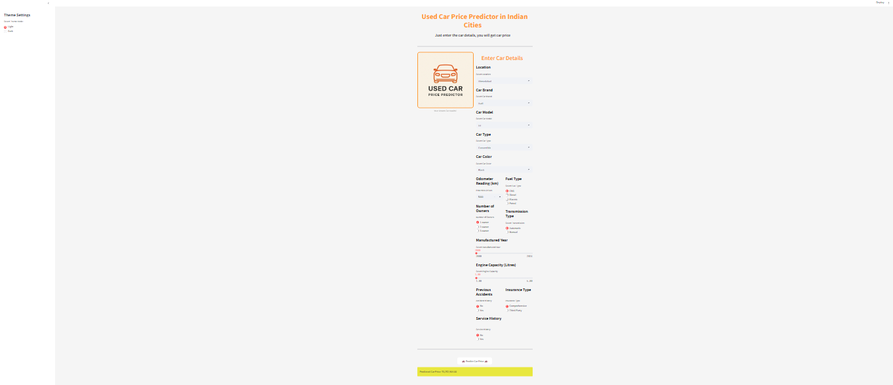
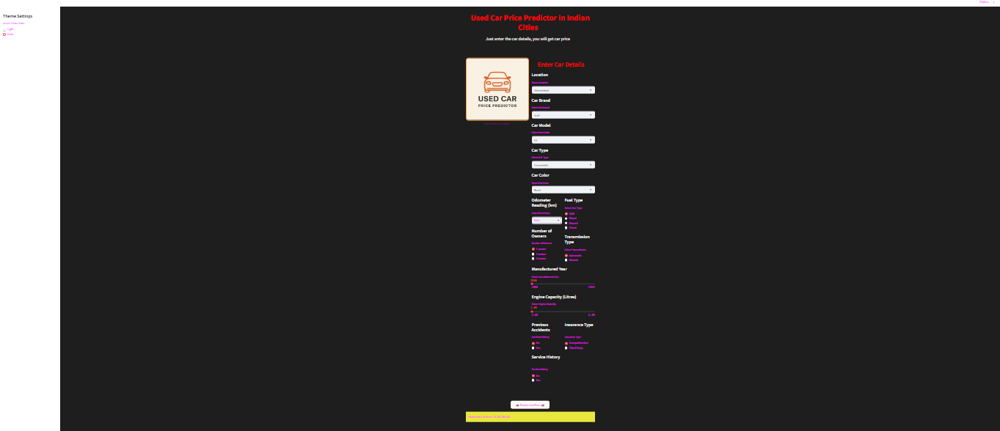

#  Used Car Price Prediction App

> A Machine Learning-powered web application to predict the selling price of a used car, featuring Light and Dark themes, built using **Streamlit** and **XGBoost Regressor**.

---

## Vist App
  [Link Text](http://used-car-price-predictor-rvkthsnlxxhn8pappcqr8cs.streamlit.app)

## Features

- Predicts the expected selling price based on car specifications.
- Beautiful **Light** and **Dark** theme support.
- Responsive UI with custom styled buttons and clean layout.
- Real-time input collection and instant prediction results.
- User-friendly, interactive web experience.

---

## 🛠️ Tech Stack

- **Python 3.9+**
- **Streamlit** (Frontend and App Deployment)
- **Pandas, NumPy** (Data Manipulation)
- **XGBoost** (Machine Learning Model)
- **Scikit-learn** (Data Preprocessing)
- **HTML/CSS** (Custom Styling)

---

   

## App

  # Light Mode 

  

  # Dark Mode

  

## Author

- venkatanarayana siliveri
- [www.linkedin.com/in/](http://www.linkedin.com/in/)venkatanarayana-siliveri

   

---

##  Credits

- Machine Learning Model: **XGBoost Regressor**
- UI Framework: **Streamlit**

---

